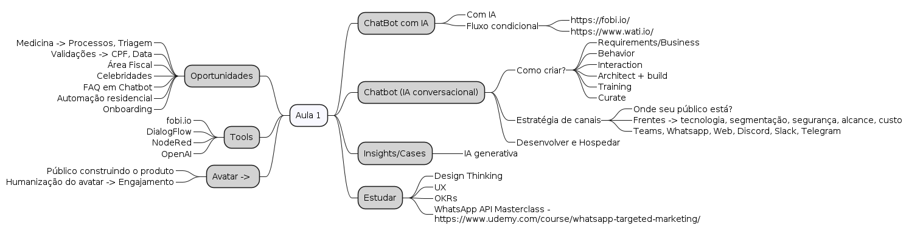
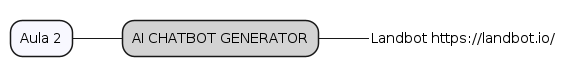
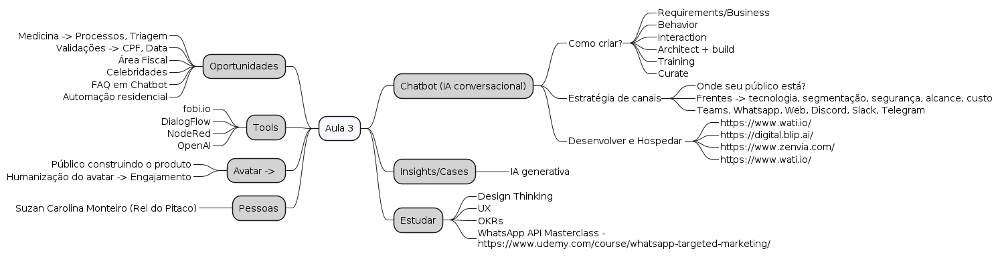

# Chatbots: do zero ao generativo

> - Instrutor: Bruno Fazoli
> - https://www.linkedin.com/in/brunofazoli/

## Conteúdo

### Aula 1 - 15/04/24

### Aula 2 - 16/04/24

### Aula 3

### Aula 4

## Tópicos

### Estudar 

- https://retool.com/

## Reference

- https://www.fiap.com.br/shift/curso/tecnologia/chatbots-do-zero-ao-cognitivo-online
