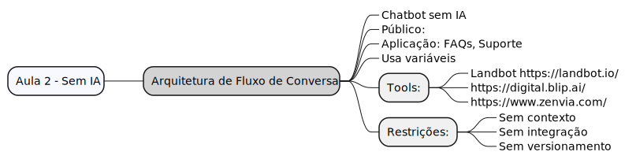
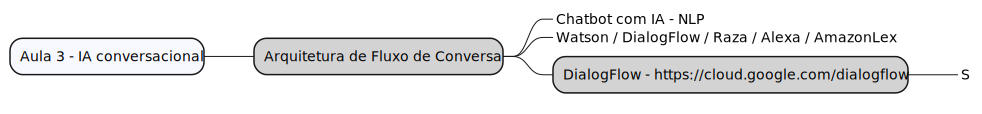
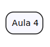

# Chatbots: do zero ao generativo

> - Instrutor: Bruno Fazoli
> - https://www.linkedin.com/in/brunofazoli/
> - https://letsbot.com.br/#home

## Conteúdo

### Aula 1 - 15/04/24

### Aula 2 - 16/04/24

### Aula 3

### Aula 4

## Tópicos

### Estudar 

- Casos de uso - https://retool.com/
- https://camunda.com/
- https://docs.infinitic.io/
- https://orkes.io/content/developer-guides/write-workflows-using-code
- analytAI - Curadoria/Critérios de análise

## Reference

- https://www.fiap.com.br/shift/curso/tecnologia/chatbots-do-zero-ao-cognitivo-online
- https://brasil.uxdesign.cc/10-heur%C3%ADsticas-de-nielsen-para-o-design-de-interface-58d782821840
- https://teachablemachine.withgoogle.com/
